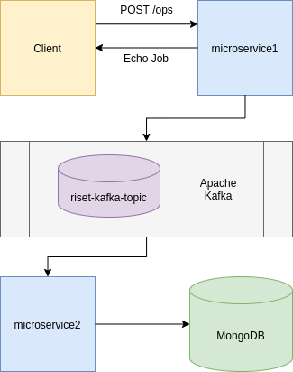

## Kafka Example Project

This project written using golang with following the module:

- [confluent-kafka-go](github.com/confluentinc/confluent-kafka-go)
- [mux](github.com/gorilla/mux)
- [mgo](gopkg.in/mgo.v2)

---
### Prerequisites

- [Kafka Cluster installation](kafka-cluster/README.md)
- [MongoDB installation](mongodb/README.md)

### Architecture


### Build program
```
git clone go.btech.id/prasta/kafka-riset.git
cd kafka-riset

# Microservice1
cd microservice1
GOOS=linux GOARCH=amd64 go build -o ../bin/microservice1

# Microservice2
cd ../microservice2
GOOS=linux GOARCH=amd64 go build -o ../bin/microservice2
```

### Program arguments

#### Microservice1

| Args | Default | Description  |
|---|---|---|
| --kafka-address | localhost:9092 | [Address]:[Port] kafka listen |
| --kafka-topic  | kafka-riset-topic | Topics to be written by producer |
| --listen  | 0.0.0.0:9090  | [Address]:[Port] that will be listened to by the webservice |

#### Microservice2

| Args | Default | Description  |
|---|---|---|
| --kafka-address | localhost:9092 | [Address]:[Port] kafka listen |
| --kafka-topic  | kafka-riset-topic | Topics to be subcribe by consumer |
| --kafka-group  | kafka-riset-group  | Consumer group name |
| --mongo-addr  | localhost:27017  | [Address]:[Port] Mongodb listen |
| --mongo-db  | job  | Mongodb target database |
| --mongo-col  | ops  | [Mongodb target database |
| --mongo-username  | -  | Mongodb password |
| --mongo-password  | -  | Mongodb username |

### Run Program

#### Running Microservice1
```
# Terminal 1
./bin/microservice1
```

#### Running Microservice2
```
# Terminal 2
./bin/microservice1 
```

### Test Program

#### Using CURL
```
curl -X POST  --data '{"name": "prasta maha","division": "project","position": "staff"}' http://localhost:9090/ops
```

#### Using Postman

Open postman with `POST` request to http://localhost:9090/ops (default addr)

Add body request with raw format and paste text below
```
{
    "name": "prasta maha",
    "division": "project",
    "position": "staff"
}
```

